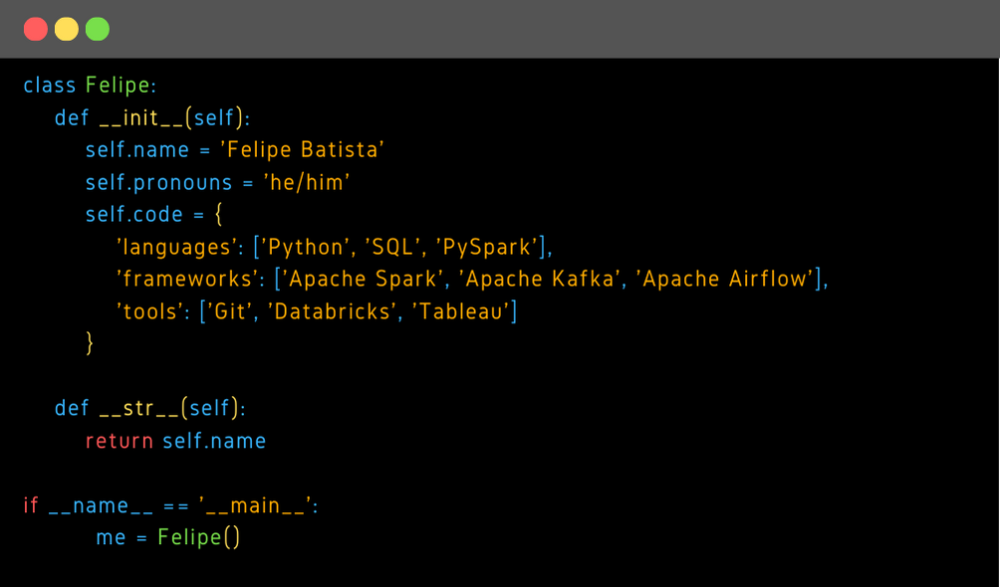

  
  

 

<h2  align="center"></h2>

  &nbsp;&nbsp;&nbsp;&nbsp;
  &nbsp;&nbsp;&nbsp;&nbsp;

 

<table>
<td>
<td>
</table>

 
 

<h1> Seja bem vindo! </h1>

<h2>Quem sou</h2>  

Formado em ciências sociais pela UNIFESP, mas estou imerso na área de dados desde 2020.
Desde o final da graduação comecei a me interessar mais por tecnologia. Iniciei meus estudos, sobre dados, a partir de cursos livres da UNIVESP, USP e CATE e muitos vídeos no YouTube. 
Já em 2021 entrei no projeto VamoAI. O programa foi oferecido pela <a href="https://www.resilia.work/">Resilia</a> em parceria com o iFood e teve como objetivo formar analistas de dados. Após 6 meses com aulas de soft e hardskills me formei no curso e ingressei como cientista de dados no iFood. 
Entrei no time de CRM, do iFood, como cientista de dados Jr. Onde desempenhei a função por 1 ano e 6 meses. Durante esse período aprendi muito sobre extração, transformação, análise, geração de insights para soluções e apresentação dos dados. Sempre trabalhando muito próximo aos stakeholders com a finalidade de criar novas soluções para CRM. Trabalhei em diversos projetos, dentre eles:

<li>Em parceria com os times de CRM desenvolvemos soluções a fim de aumentar a assertividade das comunicações com os clientes e diminuir os custos de uso de vouchers.Criamos diversas soluções de inteligência para comunicação e segmentação de usuários. 
<li>Trabalhei na elaboração de campanhas personalizadas, em que cada usuário recebia uma mensagem única com uma recomendação de um restaurante específico para ele. Conseguimos aumentar o tráfego de clicks em pushes. Nossas campanhas tiveram o melhor desempenho dentre todas as outras estratégias de comunicação do iFood. 
<li>Também atuei junto ao projeto Feynman. Um modelo de segmentação de usuários do aplicativo que separa os clientes mais ou menos persuadíveis ao receber um voucher. As campanhas que utilizam esse tipo de segmentação trazem, economia de mais de mais de 500 mil de reais ao mês.

***
<h2>Em que tenho trabalhado</h2>

Atualmente estou trabalhando em desenvolver minhas habilidades de análise e exploração de dados. Através de desafios do <a href="https://www.kaggle.com/">Kaggle</a>.

***

<h2>Até mais!

