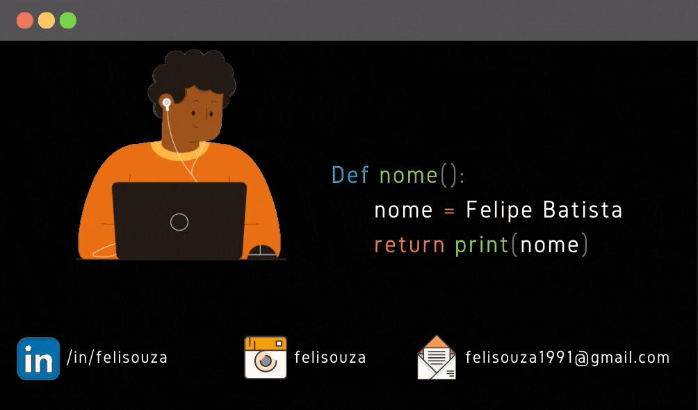

  

<table>
<th>
<th>

</table>
 

# Seja bem vindo! 

## Quem sou eu  
Sou formado em ciências sociais pela UNIFESP (Universidade Federal de São Paulo). Desde os últimos semestres da faculdade, em 2020, passei a me interessar por tecnologia.  
Entrei para o grupo de estudos [PimentaLab](https://www.pimentalab.net/) onde estudamos como as variadas tecnologias produzem o social ao mesmo tempo em que são resignificadas pela sociedade também, os problemas e soluções que a tecnologia traz etc.  
Essas investigações me levaram ao mundo dos dados. Tenho me esforçado muito para aprender a utilizar ferramentas de análise de dados, Python e R. Pois, creio que o domínio dessas linguagens de programação são meios poderosos para compreendermos o mundo em que vivemos.

***
## Em que tenho trabalhado

Atualmente faço parte de um projeto de formação de cientistas sociais, o projeto VamoAI. O curso é ofertado pela [Resilia](https://www.resilia.work/) em parceria com a [Ifood](https://www.ifood.com.br/)  
Ambas as empresas creem no poder do compartilhamento de conhecimento. De como o acesso a informação pode ser transformador na vida das pessoas. Por isso criaram uma turma tão diversa, a maior parte da turma são mulheres e pessoas negras. A oportunidade dada a nós será retribuida através de mudanças em ambientes de trabalho e no mundo.  
[Pois, a área tecnologia é defasada no quesito diversidade](https://www.meupositivo.com.br/panoramapositivo/diversidade-e-inclusao-no-setor-de-ti/). Mas, em breve, seremos mais de 30 novos profissionais, homens e mulheres negros, trabalhando com ciência de dados.

***

## Até mais!

<!--
**Felisouza/Felisouza** is a ✨ _special_ ✨ repository because its `README.md` (this file) appears on your GitHub profile.

Here are some ideas to get you started:

- 🔭 I’m currently working on ...
- 🌱 I’m currently learning ...
- 👯 I’m looking to collaborate on ...
- 🤔 I’m looking for help with ...
- 💬 Ask me about ...
- 📫 How to reach me: ...
- 😄 Pronouns: ...
- ⚡ Fun fact: ...
-->
